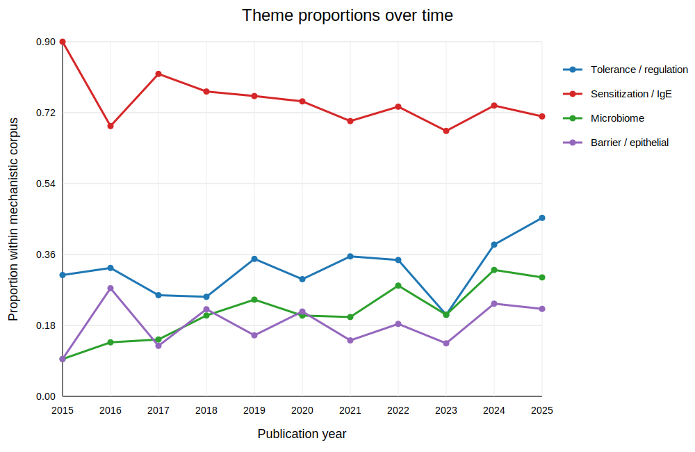
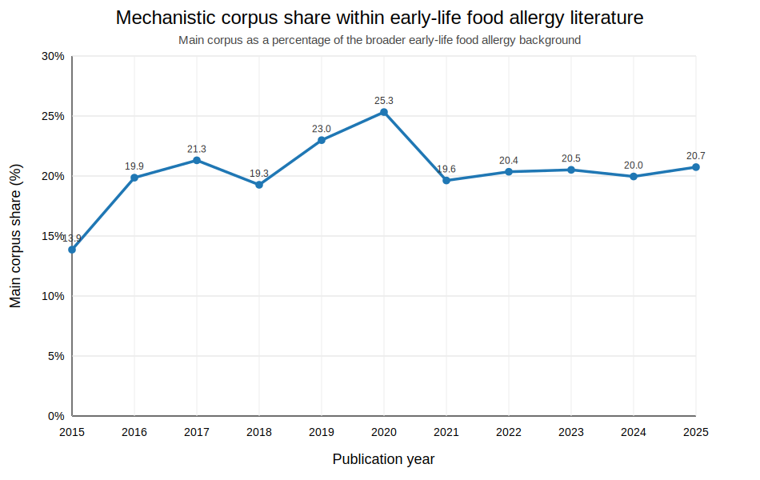

# Mechanistic theme evolution in early-life food allergy literature (2015–2026)
This project analyzes how mechanistic themes in early-life food allergy research evolved from 2015 to 2025 using PubMed-derived literature corpora.

## Research question
This project asks how mechanistic themes in early-life food allergy research changed over time from 2015 to 2025.  
The main themes of interest were:
- tolerance / regulation
- sensitization / IgE
- microbiome
- barrier / epithelial biology

## Data
The analysis used PubMed-derived literature exports from 2015 to 2025.

Two corpora were defined:
- a main mechanistic corpus focused on early-life food allergy papers with mechanistic framing
- a broader background corpus representing early-life food allergy literature without mechanistic restriction

## Methods
The workflow included:
1. cleaning PubMed exports into article-level tables
2. extracting yearly publication counts
3. defining theme buckets using title and abstract keyword rules
4. comparing the mechanistic corpus against the broader background corpus
5. modeling yearly proportions with binomial generalized linear models
6. generating final SVG figures

## Main findings
- The mechanistic corpus represented a substantial fraction of the broader early-life food allergy literature throughout the study period.
- Relative to the background field, mechanistic share followed a nonlinear pattern, increasing into the late 2010s and then stabilizing.
- Within the mechanistic corpus:
  - microbiome-related themes increased most clearly over time
  - tolerance/regulation themes also increased
  - sensitization/IgE remained dominant overall but declined modestly in proportional prominence
  - barrier/epithelial themes did not show a strong temporal trend

## Repository structure
- `scripts/` : data cleaning, modeling, and plotting scripts
- `data/processed/` : processed tables used in the analysis
- `figures/` : final project figures
- `summary/` : polished written summary of the project

## Key figures
### Theme proportions over time

### Mechanistic share relative to background

## Limitations
- Corpus boundaries depend on PubMed query design.
- Theme buckets are keyword-based and therefore approximate.
- The analysis is descriptive and bibliometric rather than causal.

## Author
Rongrong Yan

